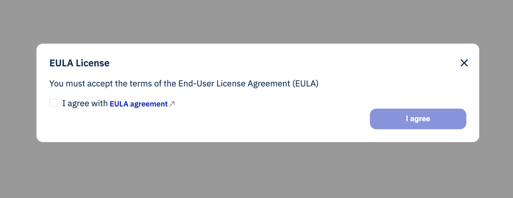

[](LICENSE)

# Radix web components

- [Radix web components](#radix-web-components)
  - [Install](#install)
  - [EULA](#eula)
    - [Props](#props)
    - [Events](#events)
    - [HTML](#html)
    - [Typescript](#typescript)
- [License](#license)

## Install

```bash
npm install @radixdlt/web-components
```

## EULA



### Props

```typescript
  @property({
    type: String,
    reflect: true,
  })
  mode: Mode = Mode.light

  @property({
    type: String,
  })
  cookieName = 'eulaAccepted'

  @property({
    type: String,
  })
  url: string = ''

  @property({
    type: Boolean,
    reflect: true,
  })
  show = false

  @property({
    type: Boolean,
  })
  checked = false
```

### Events

```typescript
@onClose: CustomEvent<{ eulaAccepted: boolean }>
```

### HTML

```html
<radix-eula url="https://radixdlt.com" />
```

### Typescript

```typescript
import '@radixdlt/web-components'

const radixEulaElement = document.querySelector('radix-eula')!

radixEulaElement.show = true

const onClose = (event: Event) => {
  const { eulaAccepted } = (event as CustomEvent<{ eulaAccepted: boolean }>)
    .detail

  console.log({ eulaAccepted })
}

radixEulaElement.addEventListener('onClose', onClose)
```

# License

The web components code is released under [Apache 2.0 license](LICENSE). Binaries are licensed under the [Radix Software EULA](http://www.radixdlt.com/terms/genericEULA)